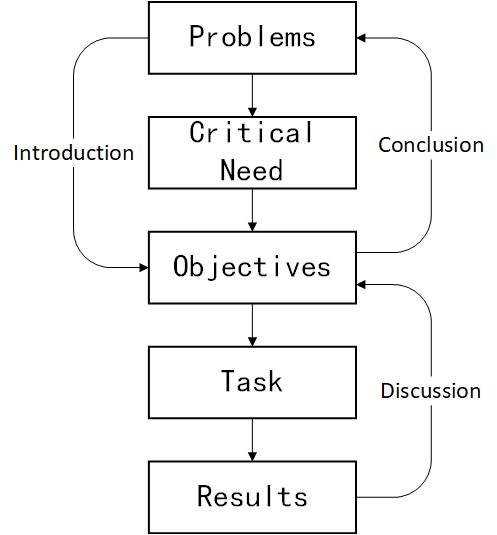

准备开始着手写自己的第一篇论文，结果憋了半个月憋不出半坨。。。

于是决定先学习一下写论文的基本流程和技巧。

## 一、论文的基本结构

基本的论文是三段式结构，分别是：引言、（目标-方法-结果）、讨论-结论。

引言段负责描述研究的背景、已有的研究成果及其不足之处、自己的改进之处、自己研究的意义等内容。该段的目的是为了让别人接受自己的研究内容，同时由于当前科研领域非常细化，也要让不了解本方向的人对研究背景和内容有一个基本的认识。

> 在论文写作过程中不要过多赘述细节，让读者能够理解你在做什么即可。即“不要说你知道什么，只说我需要知道什么。”

中间段负责详细清楚地描述自己的研究目标、研究方法和研究结果。

结论段负责总结自己的研究，在自己研究结果的基础上，引导出研究的意义，并将其普适化或一般化。

## 二、提出问题的逻辑

### 1. 基本内容

通常可以划分为两大段：

1. 提出研究点：从普遍存在的问题开始，细化到自己所研究的目标（研究空白区）。
2. 占领研究点：描述自己的研究目标（本论文目标、长期目标）。

> 通常长期目标对应于普遍存在的问题，本文目标对应于本论文研究问题。

一种模板化描述：说明为了实现长期目标，需要先实现本论文目标。

提出问题，可以先从已知的、普遍认可的问题出发，引导读者进入未知的领域，在该领域提出自己所要解决的问题。

### 2. 问题

那么如何提出一个新的问题呢？

通常一个论文所解决的问题可以分为三种：

1. 创新：解决一个未能解决的问题。
2. 延申：发展一个已经提出的方法，或者以更好的方式解决一个问题。
3. 复刻：对于已经成熟的方法，修改其中的某些部分或者应用到其他领域。

好课题的三个准则：

1. 课题应该是具体可行的。

   所谓具体，就是对问题有一个明确的认识，有清晰的研究范围，而不是盲目地提出一个宏观的问题。

   所谓可行，就是要考虑已有的资源，是否能够支撑这个研究。

2. 课题应该是开放和可争议的。

   所谓开放，就是这个课题并非闭门造车，无法与其他理论相结合。

   所谓可争议，就是这个问题是可以被证伪的，即一个问题如果不可被证伪，其本身就不具有科学研究的意义。

3. 课题应该是激发创新的。

### 3. 研究目标

确立研究目标有两个原则：大处着眼，小处着手。

研究目标应该致力于解决一些关键的问题或者受到普遍关注的问题，但实际开展研究时应该根据自身条件，将大的问题拆解为小的部分，一步一步解决。

参考上图的流程，一篇论文的三段式结构就变得比较清晰。

首先在引言部分，论述长远目标，从长远目标引申出论文的当前目标。

然后在主体部分根据当前目标设计实验等内容，给出结果。

在结尾部分，首先根据当前结果来论述当前目标，然后在此基础上，说明当前目标完成后对长期目标的贡献。

## 三、文献综述

**本篇内容同样适用于引言写作。**

文献综述的两个基本要点：

1. 对所要研究的问题密切相关的所有知识有全面了解，即包括所有相关的主要文献。
   1. 文献要全。
   2. 文献要新。
   3. 内容客观，即对于相反意见的文章也要包括在内。
2. 不是单纯的复述别人的观点，而是经过思考后用于辅佐自己的论点。
   1. 评判文献：有效性、可靠性、优势、劣势、相关程度、重要程度。
   2. 对文献归纳、演绎、溯因。找出他们的共同点、不同点以及中间的空白区。

### 1. 如何阅读论文

阅读论文主要分为两个阶段：

1. 第一阶段泛读，目的是为了明确和细化研究目标。

   本阶段首先应该先寻找优秀的综述类文献，可以更快的缩小搜索文献的范围。

   主要关注高质量论文，优先阅读摘要、结论、引言等内容。

   阅读过程中对论文进行选择排序，保留相关性较高的论文。

2. 第二阶段精读，目的是从文献中找到支撑自己研究的论据。

   对精选出的文献进行精读，寻找支撑自己的论点。

阅读文献应该边读边写，从文章中提取精炼有用的信息，并记录下对应的出处，会大大方便后续对这些信息的使用。

### 2. 如何写作综述

以讲故事的逻辑写综述，应当包含四个要素：情景（Situation）、冲突（Confliction）、问题（Question）、解决（Answer）。

下图是一个参考的综述逻辑。

按照类似的模板即可写出一个具有故事性的综述或引言。

## 四、提出观点

五段落模板：

1. 引言段：从背景触发，逐步深入，在结尾提出自己的论点
2. 二三四段：论述支持论点的理由（三个）
3. 总结论点

更好的过程模板：分解问题-正方观点-反方观点-关键补充或提升-结论。

## 五、结构化构思文章

文章的内容是为文章的结论服务，要让读者接受并认可你的结论。

文章的结构类似一个金字塔，下层的内容支撑上层内容，每层的各个模块之间互相独立，又不能遗漏信息。

## 六、分解和分析研究目标

### 1. 分解目标

当我们提出一个问题时，紧接着就要考虑如何解决这个问题。但是通常一个问题的解决方案会有很多，因此我们要全面的分析问题，总而总结出最好的解决方案。

首先要分解问题，将问题分解成多个主体，即这个问题中有哪些模块是相互独立的，修改其中某一个模块时不会对其他模块产生影响。当我们将问题分解为这样的多个独立的模块时，就可以针对每一个模块讨论可能的解决方案，进而组成最终的解决方案。

### 2. 分析目标

提出一个研究目标后，要首先明确目标中的一些相关概念，我们不可能对要研究的问题的所有方面都了解，因此要对目标有关的各种概念进行了解。

同一种概念也可能有不同的表达方式（例如不一样的名字），因此在搜索相关文献的时候要综合了解各种表达。

熟悉各种概念的过程中，要记录从事这个领域的关键团队和关键期刊，熟悉他们的研究过程和表达方式。

如果搜索发现文献量过多，可能意味着研究目标过于宽泛，应该适当细化目标。

## 七、定义和描述研究目标

